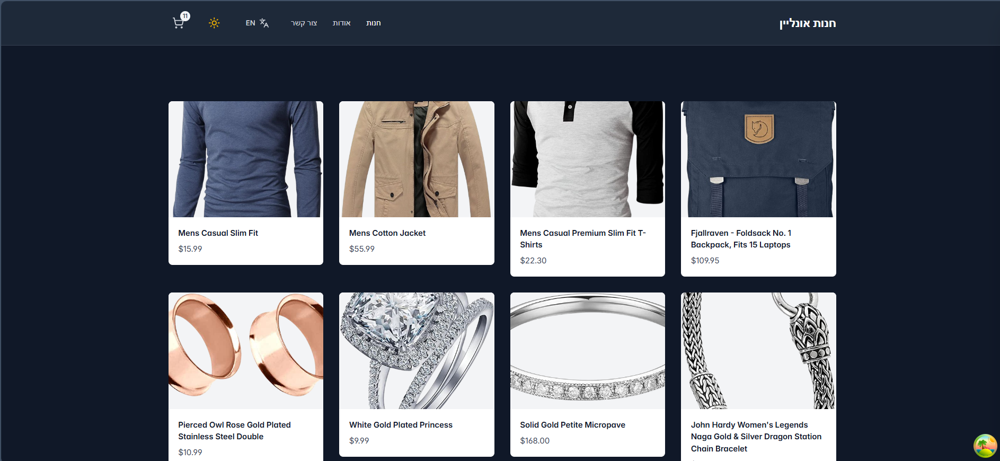
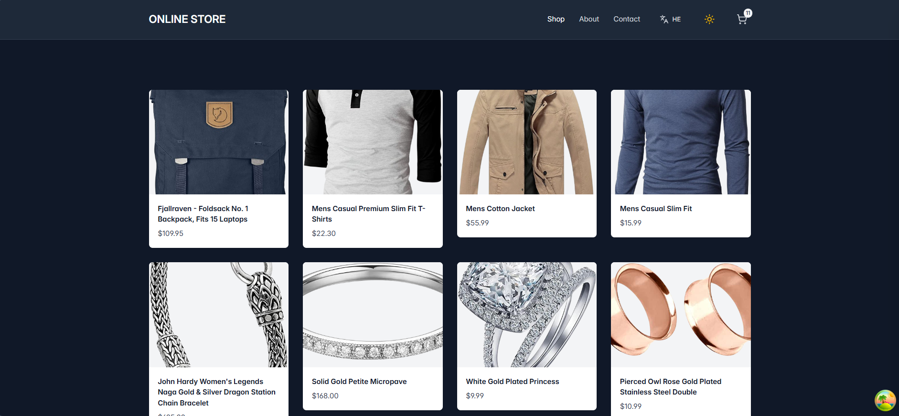
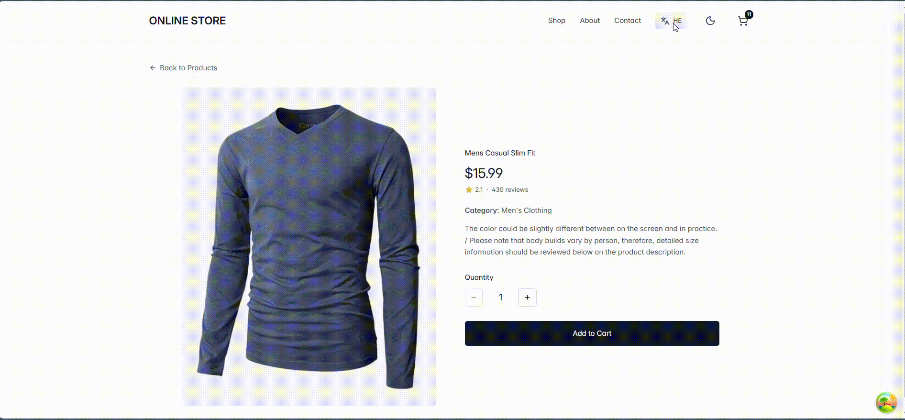
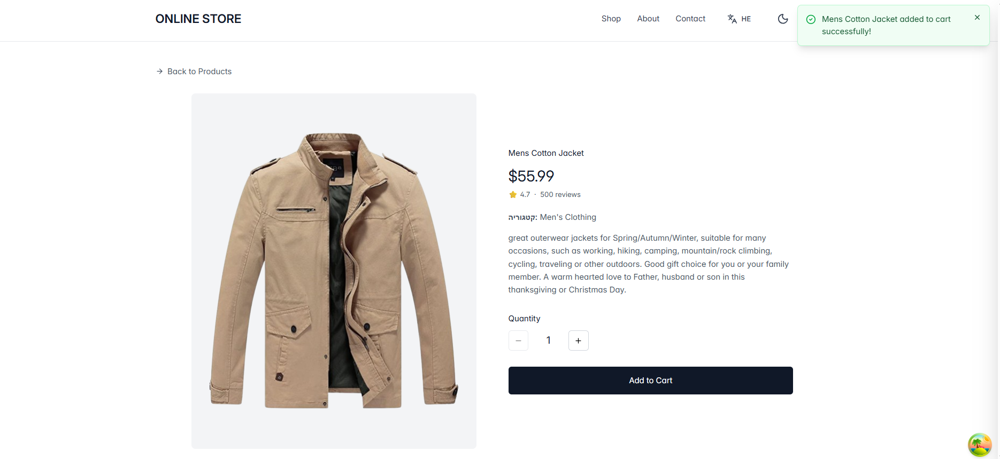
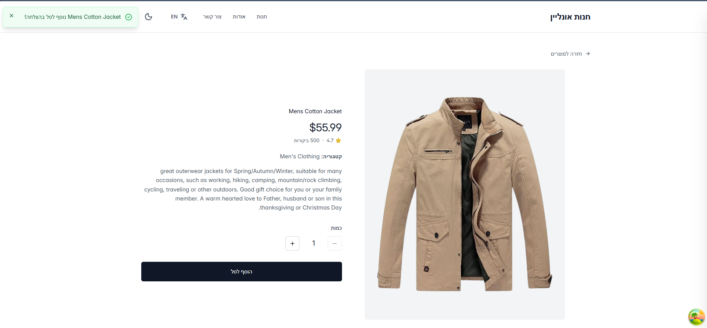
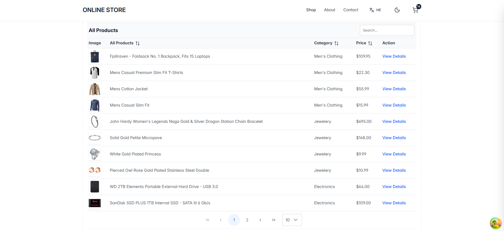
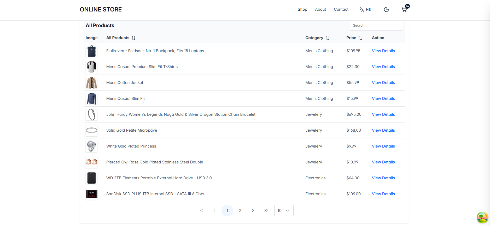
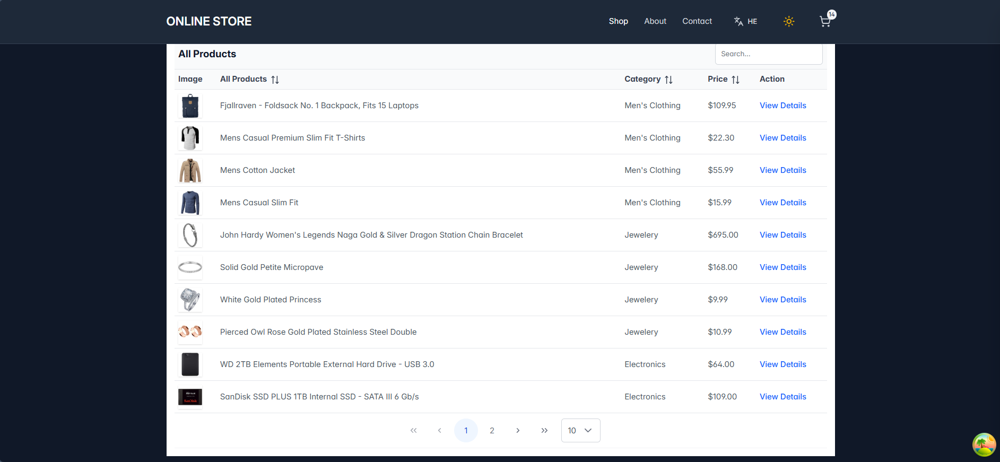

# Homework: Advanced UI & i18n
**Deliverable Step 0:** Starting Advanced 1 from the refactored Vite + TanStack Query store app. 
**API used:** [https://fakestoreapi.com/products, https://fakestoreapi.com/products/#]

## Step 1: i18n Implementation
- **Locales Used:** English (`en`), Hebrew (`he`)
- **Namespaces:** - `common`: Generic UI elements (Cart, Home, Loading)
  - `products`: Catalog titles, product details, and item counts.
- **Features:** Implemented pluralization for item counts and language detection.
- **Screenshots:**

## Step 2 - Use i18n for real

Visible UI strings have been translated across the Header, Products List, and Product Detail pages using `i18next`.

### Required i18n Examples:

| Requirement | Translation Key | UI Location | Description |
| :--- | :--- | :--- | :--- |
| **Interpolation** | `products:notifications.added` | `ProductDetailPage.tsx` (Toast) | Dynamically inserts the product name into the success message when added to cart. |
| **Pluralization** | `products:detail.reviews` | `ProductDetailPage.tsx` (Info Section) | Handles the distinction between "1 review" and multiple reviews (e.g., "120 reviews"). |
| **`<Trans>` Usage** | `products:detail.categoryLabel` | `ProductDetailPage.tsx` (Specs) | Embeds a `<strong>` tag (styled via Tailwind) inside the string to format the "Category:" label. |

---

### Implementation Summary:
- **Header/Navigation:** Translated "ONLINE STORE" logo, "Shop", "About", and "Contact" links.
- **Products List:** Translated loading indicators, error states, and the main "All Products" title.
- **Product Detail:** Translated loading/error states, "Back to Products" button, "Quantity" label, and "Add to Cart" button.
- **Namespaces:** Organized into `common` (UI/Nav/Cart) and `products` (Catalog/Detail/Data).

### Step 3 - Language Switcher + Persistence

- **Switcher:** Added a toggle button in the `Header` component using the `Languages` icon.
- **Immediate Update:** Uses `i18n.changeLanguage()` to trigger a re-render of all translated strings instantly.
- **Persistence:** - On change: Saves the new language string to `localStorage` under the key `app-language`.
  - On load: `i18n/config.ts` reads from `localStorage` to set the initial `lng` value.
- **Default:** If `localStorage` is empty, the system defaults to `en`.
- **Screenshots:**

## Step 4 - RTL Mode (Hebrew)
The application dynamically adjusts its layout to support Hebrew as a Right-to-Left (RTL) language.

- **Screenshots:**

### RTL Issue Fixes:
* **Document Direction:** A `useEffect` in the `Header` component synchronizes the current language with `document.documentElement.dir`. Setting this to `"rtl"` automatically mirrors the Flexbox grid and text alignment.
* **Icon Direction:** The "Back to Products" arrow icon is conditionally rotated 180 degrees using Tailwind's `rotate-180` class to point in the correct direction for RTL navigation.
* **Notification Placement:** Toast notifications are dynamically shifted from the top-right (`right-4`) to the top-left (`left-4`) and their entry animation is inverted to maintain a natural visual flow in Hebrew.

## Step 5 - PrimeReact DataTable Integration

The standard product list has been replaced with a high-performance **PrimeReact DataTable**, driven by TanStack Query data.

### DataTable Configuration:
- **Columns Implemented:**
    - **Image:** Rendered via a custom body template for visual previews.
    - **Title:** The primary product name.
    - **Category:** Displays product grouping with capitalized formatting.
    - **Price:** Formatted as currency using a template.
    - **Action:** A dedicated "View Details" column that handles navigation to the product's specific page.

---

### Key DataTable Features:

1. **Multi-Column Sorting:** - Enabled the `sortable` property on Title, Category, and Price columns.
   - Users can click headers to sort data ascending/descending, or use `Cmd/Ctrl + Click` for multi-sort logic.

2. **Global Filtering & Pagination:**
   - **Global Search:** Integrated a custom header with an `InputText` field that filters the entire dataset in real-time as the user types.
   - **Pagination:** Added a paginator with configurable rows per page (5, 10, 25), ensuring the UI remains clean even with large datasets.

---

### RTL Support in DataTable:
The DataTable automatically inherits the `dir="rtl"` attribute from the document root. This ensures that:
- Column order is mirrored (Image appears on the far right).
- Paginator controls (arrows) are correctly oriented for Hebrew.
- Text alignment within cells follows the locale's natural flow.

- **Screenshots:**

## Step 6 - PrimeReact Theme Switch & Persistence

The application supports dynamic theme switching that affects all PrimeReact components (DataTable, Inputs, Buttons) as well as the custom Tailwind UI.

### Theme Configuration:
- **Theme A (Default):** `lara-light-blue` (A clean, modern light professional theme).
- **Theme B (Dark):** `lara-dark-blue` (A high-contrast dark mode for reduced eye strain).

### Persistence & Restoration:
- **LocalStorage Key:** `primereact-theme-name`
- **Logic:** The `Header` component uses a custom `useLocalStorage` hook to track the theme name. On mount, a `useEffect` identifies the `<link>` tag with the ID `primereact-theme` and updates its `href` attribute to point to the correct CSS file path. This ensures the theme remains consistent even after a page refresh.
 
- **Screenshots:**

